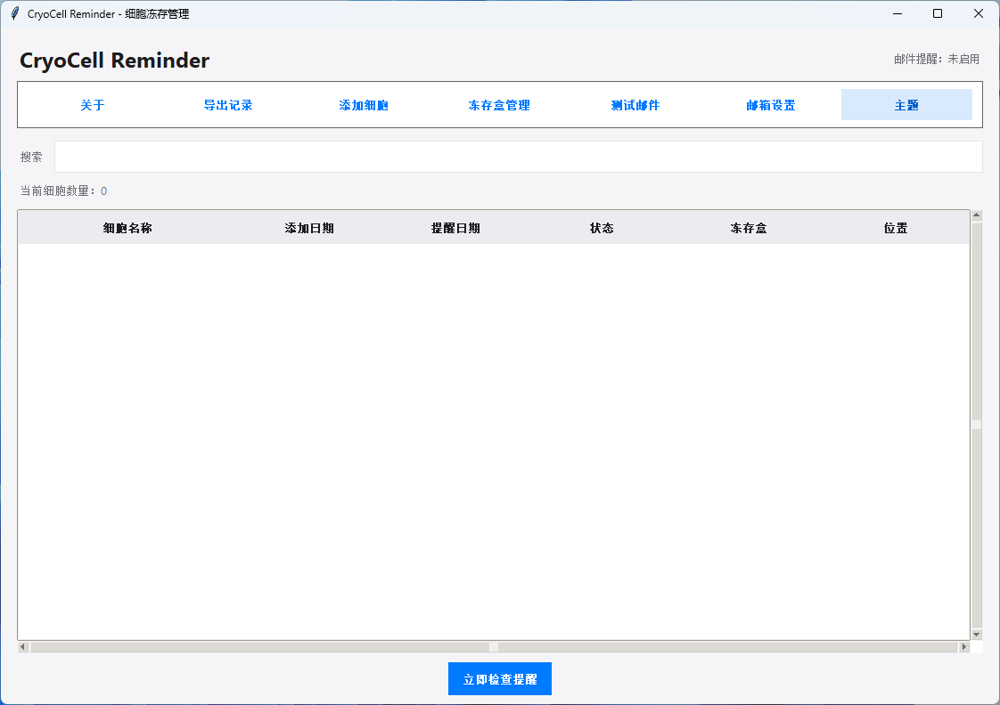
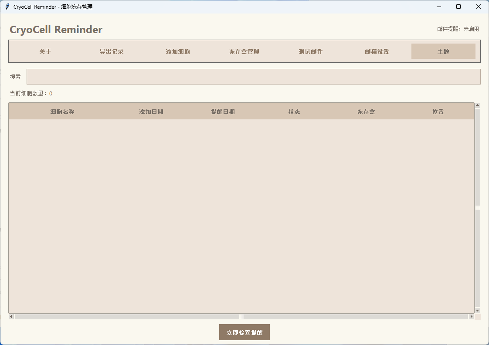
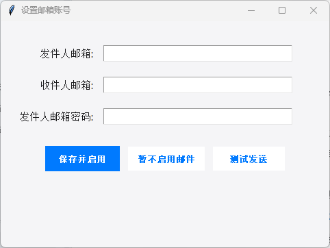

<div align="center">

# 🧊 CryoCell Reminder

### 为细胞实验室设计的可视化冻存盒管理工具

把散落在 Excel 和纸质记录中的细胞信息，变成真正直观、可拖拽、可执行的冻存盒布局。


</div>

---

## 为什么做这个软件？

做细胞实验时，我们经常遇到这些问题：

- 这支细胞究竟放在哪个冻存盒、哪个位置？
- 取走一些细胞后留下了空位，重新整理非常麻烦；
- Excel 里虽然有记录，但到了液氮罐前依然要反复确认；
- 整理多个冻存盒时，很难记住所有移动和取出步骤；
- 细胞离开液氮后，每一秒都很宝贵。

**CryoCell Reminder** 因此而生。

它把冻存盒还原成直观的 **9×9 可视化布局**。你可以像整理桌面图标一样拖动细胞、跨盒移动或批量取出，并自动生成简洁的实际操作指令：

```text
1A9 → 1B9
1A7 OUT
1A8 → 2C5
```

提前在电脑上规划，到了液氮罐前只需照单操作——少一点寻找，多一点从容。

## 界面预览



<details>
<summary>查看 2048 棕色主题</summary>



</details>

## 核心功能

### 🖱️ 真正好用的冻存盒整理

- 可视化 9×9 冻存盒布局；
- 点击选择、再次点击取消选择；
- 拖拽移动或交换细胞位置；
- 支持跨冻存盒移动；
- 支持批量选择与取出。

### 📝 自动生成整理操作单

- 记录盒内移动、跨盒移动及取出操作；
- 指令刻意保持简短，适合在液氮罐前快速阅读；
- 支持保存、导出和打印，方便按照步骤完成实体冻存盒整理。

### 📊 兼容已有 Excel 数据

- 从 Excel 工作表中手动指定任意 9×9 区域；
- 支持粘贴 Excel 9×9 数据；
- 支持空位置，不要求每个格子都有细胞；
- 导入前预览并自定义冻存盒名称；
- 可导出标准导入模板。

### 🔍 日常记录管理

- 添加、搜索和删除细胞记录；
- 显示冻存日期、提醒日期、冻存盒和位置；
- 导出细胞记录及冻存盒布局；
- 删除冻存盒时保留细胞记录，只清除盒子与位置关联。

### 🎨 简洁且舒适的界面

- 清爽浅色、淡粉柔和、暗黑模式和 2048 棕色主题；
- 窗口自动适配不同屏幕分辨率；
- 清晰的选中状态与流畅的拖拽反馈。

### ✉️ 完全可选的邮件提醒

- 首次启动可以直接选择“暂不启用邮件”；
- 未启用时不会启动邮件调度线程，也不会尝试发送邮件；
- 如有需要，可随时在“邮箱设置”中重新启用。



## 下载与使用

1. 打开本仓库右侧的 **Releases**；
2. 进入最新版本；
3. 在 **Assets** 中下载 `CryoCell_Reminder_v5.13.exe`；
4. 双击运行，无需安装 Python；
5. 首次使用建议先用测试数据熟悉操作。

> Windows 可能会对尚未购买代码签名证书的独立开发软件显示安全提示。请只从本项目官方 Releases 页面下载，并核对发布页提供的 SHA256。

当前 v5.13 校验值：

```text
SHA256  2FE1484FC46D4B0BE04602756A028F002A82778ECA9E3E1F33226F3B2207F0A1
```

## 从源代码运行

需要 Python 3.10 或更高版本，推荐 Python 3.12。

```bash
pip install schedule openpyxl pandas
python CryoCell_Reminder_v5.0-CLEAN.py
```

构建 Windows 单文件 EXE：

```bash
pip install pyinstaller
pyinstaller --noconfirm --clean CryoCell_Reminder_v5.0.spec
```

生成的程序位于 `dist/CryoCell_Reminder_v5.13.exe`。

## 数据与隐私

- 细胞记录保存在软件所在目录的本地 SQLite 数据库中；
- 软件不会主动把实验数据上传到云端；
- 邮件功能为可选功能，未启用时不会连接邮件服务器；
- 请勿公开上传自己的 `cell_freeze.db`、`email_config.json`、实验 Excel 或日志文件；
- 在导入、整理或升级前，建议备份重要实验数据。

## 适合谁使用？

- 进行细胞培养与冻存的科研人员；
- 管理共享细胞库或液氮罐的实验室成员；
- 希望从 Excel 过渡到可视化管理的小型实验室；
- 需要清晰记录冻存盒调整过程的使用者。

## 反馈与贡献

这是一个从真实实验需求中诞生的工具。如果你发现问题，或者希望增加新的冻存盒规格、导入方式与管理功能，欢迎通过 **Issues** 提交建议。

如果这个项目帮你节省了寻找细胞和整理冻存盒的时间，也欢迎点一个 ⭐ Star，让更多有同样需求的实验室看到它。

## 使用提醒

本软件用于辅助实验记录与冻存盒整理，不能替代实验室原始记录、标准操作规程或必要的数据备份。涉及重要样本时，请在实际操作前再次核对。

---

<div align="center">

**让冻存盒整理更直观，让每一次液氮操作更迅速。**

Made for cell researchers 🧫

</div>
